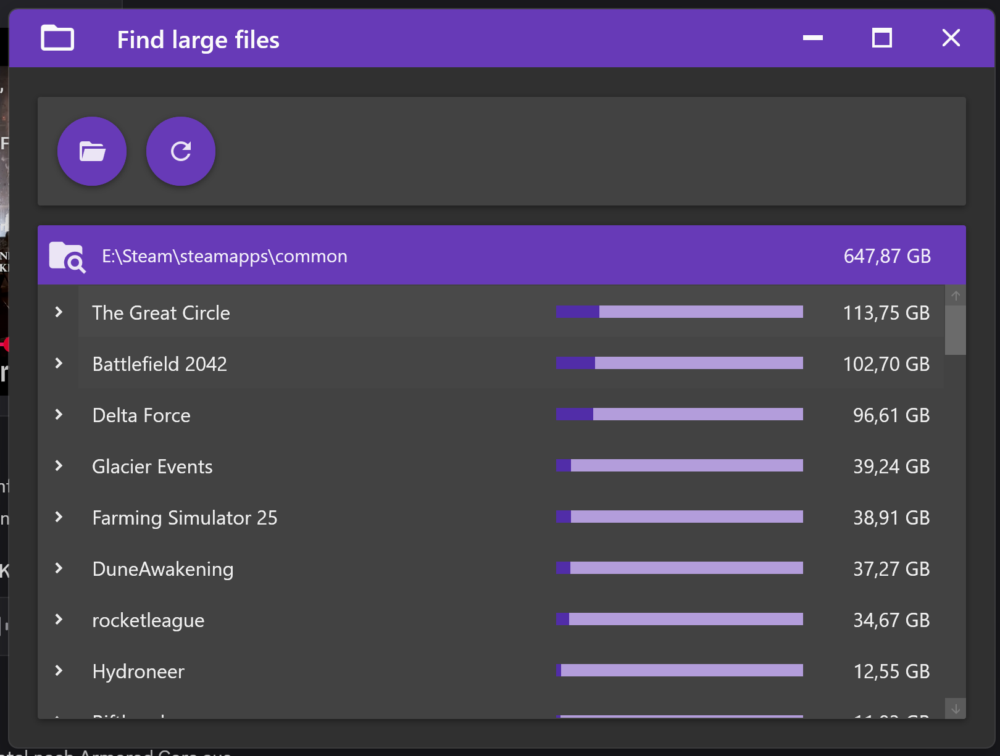

# Find Large Files

**Find Large Files** is a Windows Presentation Foundation (WPF) application designed to help users quickly identify large files and folders on their system. It provides a clear, hierarchical view of disk usage, making it easier to manage storage space.

[DOWNLOAD](https://drive.google.com/file/d/12bqDs_A1K-orqNNKA_-cC6GZFDvySp05/view?usp=drive_link)

---

## ✅ Features

- **Scan Directories for Large Files and Folders**
  - Analyze a specific directory or an entire drive.
- **TreeView Display**
  - Visualize files and folders in a structured tree format.
- **Size Calculation**
  - Displays the size of each file and folder for easy comparison.
- **Sorting & Filtering**
  - Sort by size or name to find the largest files instantly.
- **User-Friendly UI**
  - Simple and responsive WPF interface.

---